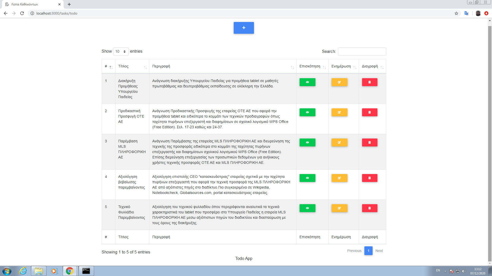
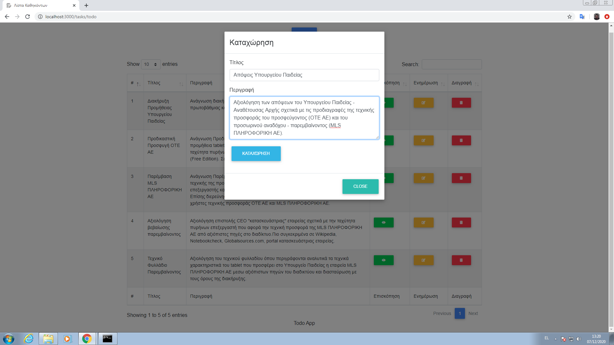
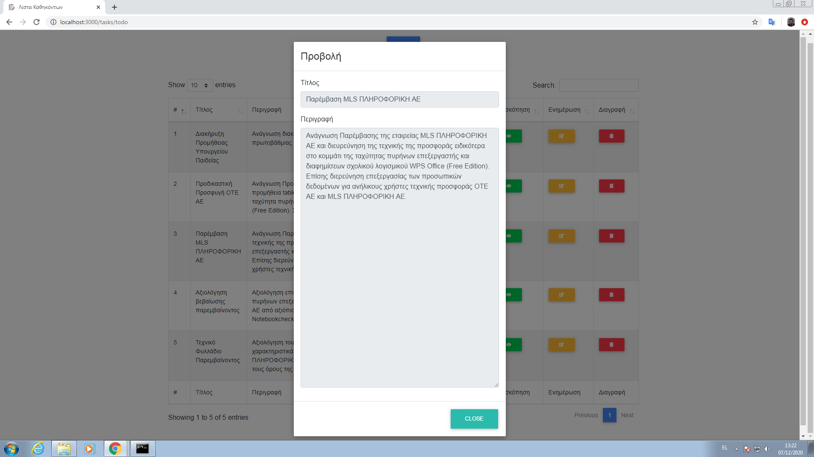
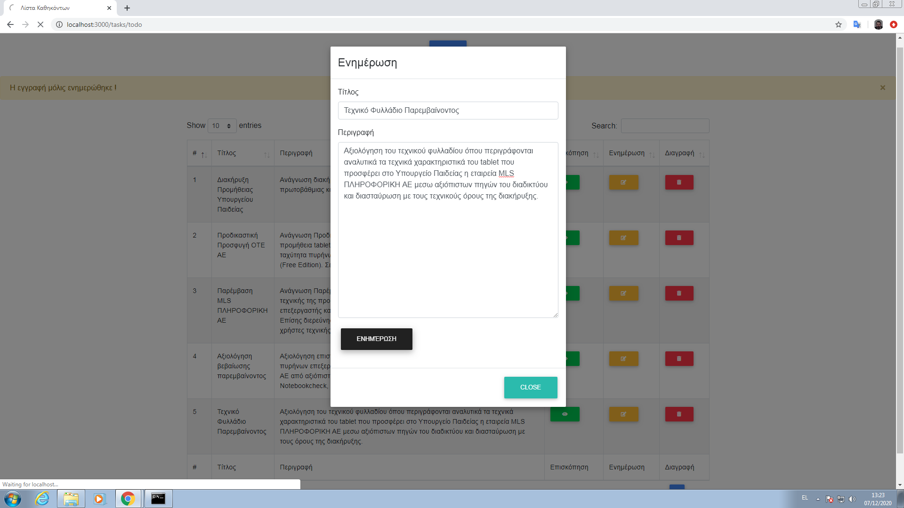
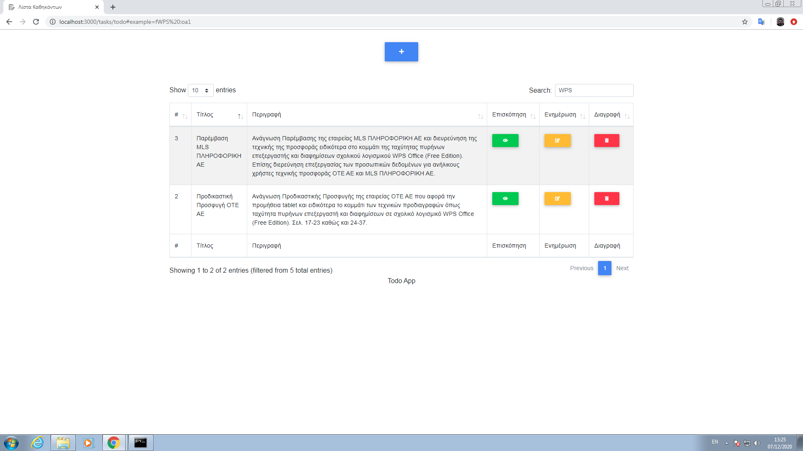

                                           List Todo App

A CRUD GIN Framework app where the user is able to register a Todo task into a list via specific title and description. The user has also the ability to search for specific information into the Todo list and proceed accordingly into the Todo task specific action such as view, update or delete (Todo task completion). Additionally there is the option of alphabetical order (ASC or DESC) via title or description as well as drag and drop feature of specific row and individual action storage of unique keyword search and sorting order.
This app has been made via [GIN Web Framework](https://gin-gonic.com/), [GORM](https://gorm.io/index.html), [Bootstrap](https://getbootstrap.com/), [fontawesome icons](https://fontawesome.com/), [SQLite](https://sqlitestudio.pl/) as DBMS and [Datatables plugin](https://datatables.net/). [Golang](https://golang.org/) is required to be installed for its sucessful operation. 

**Main view**

**Insert view**

**Display view**

**Update view**

**Search-Sort view**

